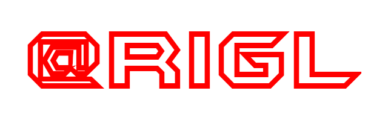

# Rigl.js



<br>

**Rigl** is a framework for building reactive Web Components. In addition to a convenient way to create components and add reactive behavior to them, Rigl provides an Observer for tracking events between different components and a simple Router.

<br>

1. [Beginning of work](#beginning-of-work)
2. [External components](#external-components)
3. [Replacing components](#replacing-components)
4. [Expressions](#expressions)
5. [Properties](#properties)


<br>
<hr>
<br>

<h2 id="beginning-of-work">Beginning of work</h2>

<br>

There are two types of components in Rigl: built-in and external. To create a component embedded in an HTML page, you must use the *TEMPLATE* tag with the ***title*** attribute, which specifies the name of the component:

```html
<template title="r-header">
  <!-- component content -->
</template>
```

Tags, styles and its scripts can be located inside the component:

```html
<template title="r-header">
  <h1>Hello ${ message }!</h1>

  <style>
    h1 {
      color: orangered;
    }
  </style>

  <script>
    this.message = 'Rigl'
  </script>
</template>
```

To insert a component into the content of an HTML page, use custom tags corresponding to the name of the component:

```html
<r-header></r-header>
```

After the component template has been defined, it must be passed to the creation function in Rigl:

```html
<!-- connect Rigl -->
<script src="rigl.min.js"></script>

<!-- pass the component template to the create function -->
<script>
  Rigl.create(document.querySelector('template[title]'))
</script>
```

Multiple components can be transferred at a time:

```html
<!-- pass multiple templates to create function -->
<script>
  Rigl.create(document.querySelectorAll('template[title]'))
</script>
```

Thus, the full cycle of creating an inline component is demonstrated below:

```html
<!DOCTYPE html>
<html lang="en">
<head>
  <meta charset="UTF-8">
  <meta http-equiv="X-UA-Compatible" content="IE=edge">
  <meta name="viewport" content="width=device-width, initial-scale=1.0">
  <title>Rigl</title>
</head>
<body>
  <!-- component mounting -->
  <r-header></r-header>


  <!-- component template -->
  <template title="r-header">
    <h1>Hello ${ message }!</h1>

    <style>
      h1 {
        color: orangered;
      }
    </style>

    <script>
      this.message = 'Rigl'
    </script>
  </template>
  

  <!-- connect Rigl -->
  <script src="rigl.min.js"></script>

  <!-- fetching and passing the component template to the create function -->
  <script>
    Rigl.create(document.querySelector('template[title]'))
  </script>
</body>
</html>
```
<br>

<h2 id="external-components">External components</h2>

<br>

Components in Rigl can be put into separate files with the *.htm* extension and then assembled into one file, for example, using *Gulp*. The collected file will be connected on the main page through the upload function in Rigl:

```html
<!DOCTYPE html>
<html lang="en">
<head>
  <meta charset="UTF-8">
  <meta http-equiv="X-UA-Compatible" content="IE=edge">
  <meta name="viewport" content="width=device-width, initial-scale=1.0">
  <title>Rigl</title>
</head>
<body>
  <!-- mounting components -->

  <r-header id="header"></r-header>

  <main is="r-content"></main>

  <r-footer></r-footer>

  <!-- ******************* -->
  

  <!-- connect Rigl -->
  <script src="rigl.min.js"></script>

  <!-- passing the path to the component file in the load function -->
  <script>
    Rigl.load('components.htm')
  </script>
</body>
</html>
```

**Working with external components requires the use of a server, for example *lite-server***

Unlike built-in components, templates for external components are located in tags corresponding to the names of the components. The ***title*** attribute is no longer used in them, since the name of the component is determined by its parent tag:


```html
<r-header>
  <h1>Hello ${ message }!</h1>

  <style>
    h1 {
      color: orangered;
    }
  </style>

  <script>
    this.message = 'Rigl'
  </script>
</r-header>
```

 When using the *Gulp* task manager, the approximate project structure might look like this:

```
app
  index.html
  package.json
  gulpfile.js
  /src
    /assets
      rigl.min.js
      /img
        logo.png
    /components
      content.htm
      footer.htm
      header.htm
      menu.htm
  /dist
    components.htm
    rigl.min.js
    /img
      logo.png 
```

And the content of the *gulpfile.js* file can be like this:

```js
const gulp = require('gulp')
const concat = require('gulp-concat')
const browserSync = require('browser-sync').create()
const del = require('del')


function components() {
  return gulp.src('src/components/*.{html,htm}')
    .pipe(concat('components.htm'))
    .pipe(gulp.dest('dist'))
}

function serve(done) {
  browserSync.init({
    server: { baseDir: "./" }
  })
  done()
}

function reload(done) {
  browserSync.reload()
  done()
}

function clean() {
  return del('dist')
}

function copy() {
  return gulp.src('src/assets/**/*.*')
    .pipe(gulp.dest('dist'))
}

function watch() {
  gulp.watch('index.html', gulp.series(reload))
  gulp.watch('src/**/*.{html,htm}', gulp.series(components, reload))
}

const dev = gulp.series(clean, copy, components, serve, watch)

gulp.task('default', dev)
```
<br>

<h2 id="replacing-components">Replacing components</h2>

<br>

Components can replace standard HTML elements. For example, the *R-HEADER* component can replace the *HEADER* element. To do this, the ***slot*** attribute is used in the parent tag of the component template, which indicates the name of the element that replaces the component:

```html
<r-header slot="header">
  <h1>Hello ${ message }!</h1>

  <style>
    h1 {
      color: orangered;
    }
  </style>

  <script>
    this.message = 'Rigl'
  </script>
</r-header>
```

The HTML element itself uses the ***is*** attribute, which indicates the name of the component that replaces this element:

```html
<!DOCTYPE html>
<html lang="en">
<head>
  <meta charset="UTF-8">
  <meta http-equiv="X-UA-Compatible" content="IE=edge">
  <meta name="viewport" content="width=device-width, initial-scale=1.0">
  <title>Rigl</title>
</head>
<body>
  <!-- replacing the HEADER element with the R-HEADER component -->
  <header is="r-header"></header>
  

  <!-- connect Rigl -->
  <script src="rigl.min.js"></script>

  <!-- passing the path to the component file in the load function -->
  <script>
    Rigl.load('components.htm')
  </script>
</body>
</html>
```
<br>

<h2 id="expressions">Expressions</h2>

<br>

Expressions in Rigl use the template string syntax *${ expression }*. Expressions can contain any valid JavaScript and custom properties. They can be placed anywhere in the component where the value can be displayed, for example, in attributes, text nodes, and styles. All nodes that use expressions become reactive:

```html
<r-header>
  <!-- expression in the text content of the H1 element -->
  <h1>Hello ${ message }!</h1>

  <!-- expression in the "title" attribute of the H1 element -->
  <h1 title="${ message }">Hello!</h1>

  <style>
    h1 {
      /* expression in the style property of the H1 element */
      color: ${ titleColor() };
    }
  </style>

  <script>
    this.message = 'Rigl'
    this.titleColor = () => 'orangered'
  </script>
</r-header>
```
<br>

<h2 id="properties">Properties</h2>

<br>